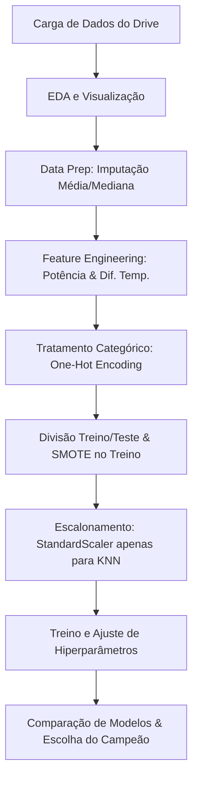

# SensorGuard 4.0 - Pipeline Preditivo para Indústria 4.0
**SensorGuard 4.0** é uma solução de Inteligência Artificial voltada para a **Manutenção Preditiva** em ambientes industriais automatizados. O sistema analisa dados históricos de sensores de maquinários para prever falhas antes que elas aconteçam, otimizando o planejamento de manutenção e evitando paradas inesperadas na linha de produção.
---
## 📌 1. O Problema que Resolve
Na Indústria 4.0, paradas não planejadas de maquinários causam prejuízos milionários e atrasos severos na cadeia de suprimentos. O **SensorGuard 4.0** resolve esse problema ao monitorar variáveis de sensores em tempo real (temperaturas, velocidade de rotação, torque e desgaste de ferramentas) e classificar se a máquina está sob risco iminente de falha (`falha_maquina`).
O modelo auxilia engenheiros de confiabilidade a atuar de forma preventiva nas falhas mais comuns:
* **Falha de Desgaste de Ferramenta (TWF)**
* **Falha de Dissipação de Calor (HDF)**
* **Falha de Sobrecarga de Potência (PWF)**
* **Falha por Excesso de Esforço (OSF)**
---
## 🛠️ 2. Tecnologias e Técnicas Utilizadas
### Tecnologias:
* **Linguagem Principal:** Python 3.x
* **Manipulação e Análise de Dados:** `pandas`, `numpy`
* **Visualização de Dados:** `matplotlib`, `seaborn`
* **Machine Learning & Pré-processamento:** `scikit-learn`
* **Balanceamento de Dados:** `imbalanced-learn` (SMOTE)
* **Algoritmos de Boosting:** `xgboost`, `lightgbm`
### Arquitetura do Pipeline:


### 💡 Técnicas de Destaque Aplicadas:
* **Tratamento de Dados Faltantes (Imputação Estatística):** Imputação pela **Média** para curvas simétricas (`temperatura_ar_k`, `temperatura_processo_k` e `torque_nm`) e pela **Mediana** para curvas assimétricas (`velocidade_rotacao_rpm`).
* **Engenharia de Atributos (Feature Engineering):**
  * `potencia_kw`: Cálculo da potência rotativa física com base na rotação (RPM) e torque (Nm).
  * `diferenca_temperatura_k`: Isolamento do calor interno do motor para facilitar a detecção de superaquecimentos (HDF).
* **One-Hot Encoding (`drop_first=True`):** Tratamento de variáveis categóricas sem induzir uma falsa ordem hierárquica e evitando a multicolinearidade.
* **Balanceamento de Classes (SMOTE):** Geração de dados sintéticos de falhas na base de treino para combater a disparidade natural dos dados fabris (onde ~96% dos dados são de funcionamento normal).
* **Combate ao Data Leakage (Vazamento de Dados):** O escalonamento (`StandardScaler`) e o balanceamento (`SMOTE`) foram ajustados estritamente na base de treino.

---

## 📈 3. Resultados e Escolha do Modelo Final
Durante a fase de experimentos e validação às cegas (dados de teste), os modelos apresentaram o seguinte desempenho de acurácia:

| Modelo | Configuração Campeã | Acurácia de Teste |
| :--- | :--- | :--- |
| **LightGBM** | Learning Rate = 0.2 | **97.15%** |
| **XGBoost** | Estimators = 100 | **97.00%** |
| **Árvore de Decisão** | Max Depth = 10 | **94.60%** |
| **K-Nearest Neighbors (KNN)** | K = 3 | **92.35%** |

O **LightGBM** foi selecionado como o modelo final devido ao seu altíssimo poder preditivo (97.15%), ótimo controle contra *overfitting* (variação treino/teste de apenas 2.55%) e eficiência de processamento em tempo real.

---

## 🚀 4. Como Executar o Sistema
### Pré-requisitos
Certifique-se de ter o Python 3 instalado em seu computador.

### Passo a Passo

1. **Clonar o Repositório:**
   ```bash
   git clone git@github.com:susejgo89/projetofinal_M1.git
   cd projetofinal_M1
   ```

2. **Criar e Ativar um Ambiente Virtual (Recomendado):**
   * No Windows:
     ```bash
     python -m venv .venv
     .venv\Scriptsctivate
     ```
   * No Linux/macOS:
     ```bash
     python3 -m venv .venv
     source .venv/bin/activate
     ```

3. **Instalar as Dependências:**
   ```bash
   pip install -r requirements.txt
   ```

4. **Executar o Notebook:**
   Abra o seu VS Code (ou terminal Jupyter) e execute o arquivo principal:
   ```bash
   pipeline_preditivo.ipynb
   ```
   > [!NOTE]
   > O dataset é carregado de forma direta e automática do Google Drive pela nuvem no início do notebook.

---

## 🔮 5. Melhorias Futuras (Backlog)
* **Deploy de API:** Criar uma API leve em FastAPI para receber dados em tempo real dos sensores e responder com o diagnóstico de falha.
* **Painel Interativo:** Desenvolver um dashboard em Streamlit para a equipe técnica acompanhar graficamente o status de cada máquina.
* **Otimização de Hiperparâmetros Avançada:** Utilizar bibliotecas como o Optuna para refinar os hiperparâmetros de Boosting de forma automatizada.
* **Ajuste de Métrica de Negócio:** Mudar o foco de otimização de Acurácia para Recall ou F1-Score, para minimizar ao máximo os falsos negativos (máquinas que quebram sem o aviso do sistema).
